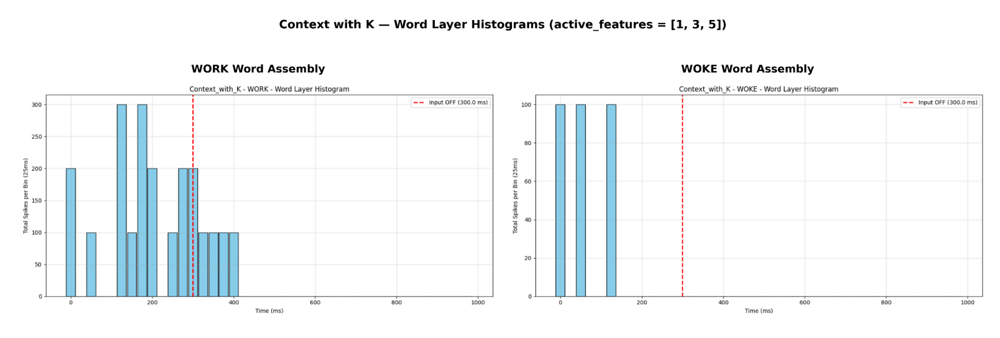
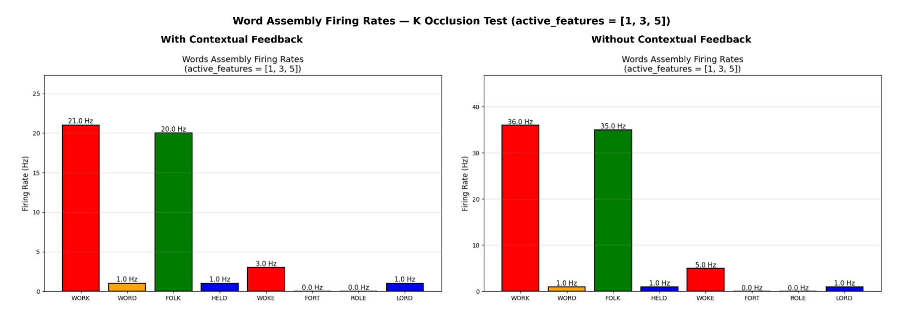

# Word Superiority Effect Experiments Implemented using a Spiking Neural Network

A spiking neural network (SNN) built to test whether a biologically-inspired model can reproduce the **Word Superiority Effect** — the finding that people recognise letters faster and more accurately when they appear within a word than in isolation. Built as a Final Year Undergraduate project.

> *These two systems are different architectures of an SNN network that conduct an occlusion experiment & a sequential letter presentation experiment relating to the WSE.*

Using the PyNN & NEST libraries for Python, I built a spiking neural network architecture to replicate the conditions of the Rumelhart and McClelland Occlusion Experiment relating to WSE.

## Results

- The model did reproduce the Word Superiority Effect.  It successfully used contextual-feedback to predict the rest of the word based on both a chosen target letter, and occluded features of a word.
- System 2 performed better and had a higher level of clarity within its results as the replacement of a single shared wickelfeature assembly with independant assemblies for each letter removed the letter-bleed effect that was created with the former system architecture.

**Example output:**




## Overview
Main Features:
- Two Systems (System 1 with a shared wickelfeature assembly for all letter assemblies, System 2 with each letter assembly having a personal wickelfeature assembly)
- Able to conduct 2 experiments: Letter Occlusion (features within the letter are obscured), and Sequential Letter Presentation (showing the letters in a word at sequential time steps)
- Plots the spike data and firing rates to histograms and bar charts respectively
- Exports the spike data to .pkl files, which can be read with files in the **Utils** directory

## Tech Stack
Python · NEST Simulator · PyNN · NumPy · Matplotlib

## Requirements
- Python 3.8 or later
- Linux or macOS (NEST does not support Windows natively)

### Installation (Linux)
1. Install Python
```py
sudo apt install python3-pip
```
2. Create a virtual environment - example directory name 'iac_model_env' (optional)
```py
apt install python3.8-venv
python3 -m venv iac_model_env
source iac_model_env/bin/activate
```
3. Get PPA Repository for NEST & Install NEST Simulator
```py
sudo add-apt-repository ppa:nest-simulator/nest
sudo apt-get update
sudo apt-get install nest
```
4. Install PyNN
```py
pip install pyNN
```
5. Install Other Dependencies
```py
pip install numpy matplotlib
```

## Usage Instructions
- Use RUN_OCCLUSION_TEST & RUN_SEQUENTIAL_TEST to control what tests are run
```py
RUN_OCCLUSION_TEST = False
RUN_SEQUENTIAL_TEST = True
```
- Choose what letter features are activated in either 'occlusion_test' or 'sequential_test'
```py
# Test Title | Active features of the letter | If contextual feedback is enabled
    occlusion_test = [  
        ("Isolated_D", [1, 4], False),
    ]
```
- Alternatively, uncomment one of the preset experiments within the 'occlusion_test' or 'sequential_test' arrays

## What I'd Explore Next
1. Add either a CLI or GUI interface to make usage smoother
2. Remove Tsodyks-Markram synapses and try adaptive neurons to fix runaway excitation
3. Add more varying features/letters/words
4. Recreate other WSE experiments

## Background

Built as a Final Year Undergraduate project at Middlesex University, combining computational neuroscience (the Interactive Activation and Competition model) with spiking neural network implementation.
